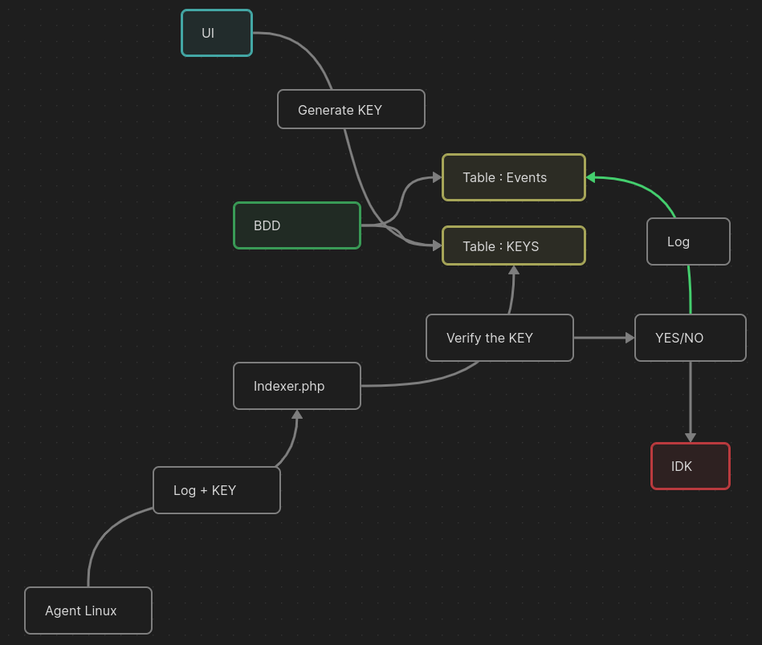

 
## Security information and event management
Eagle SIEM allows you to centralize, correlate and analyze logs in real time to detect and respond to security threats. It has agents for Linux and Windows, very customizable and adaptable to many situations.
Its interface allows you to directly filter logs with SQL queries, save them and apply regex detection filters.

## Installation
### Server side
#### Installation
```
git clone https://github.com/carambole25/Eagle-SIEM.git
cd Eagle-SIEM/
bash installation.sh
```
#### Ports
```
http://localhost:80    ui
http://localhost:8080  indexer
http://localhost:7777  phpmyadmin
http://localhost:3306  mysql
```

### Agent
Wget the agent zip file (display in the ui)
```
wget http://srv_ip/agent_linux.zip
```

Unzip it
```
unzip agent_linux.zip
```

- Get an api key from the ui and put it in the conf/api_key

- List files to monitor in file_to_monitore.lst

- Choose a hostname for the agent in hostname.conf

Launch the installation script :
```
bash installation_agent_linux.sh
```

## Architecture v1


## ToDo for v2
- [X] httpS for ui
- [X] auth system for ui
- [X] change the ui password in the ui
- [X] update the installation script to not use sudo docker
- [X] installation tutorial and powershell script for windows
- [ ] make the ui less catastrophic
- [ ] adding ids functionality for linux
- [ ] adding ids functionality for windows
- [ ] regex owasp module for http logs
